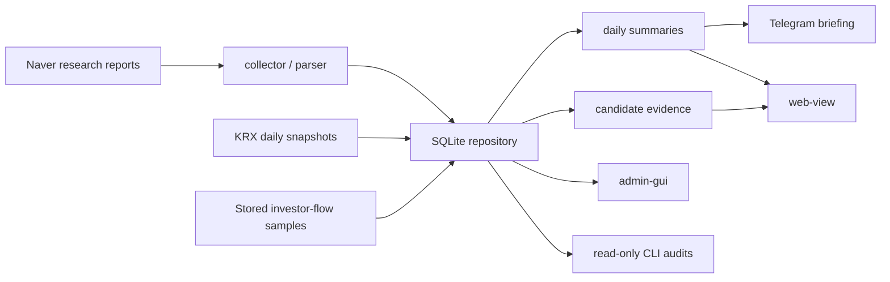

# Stock Monitor


국내 리서치 리포트와 저장된 KRX 기준 데이터를 묶어, 매일 확인할 종목과 시장 흐름을 읽기 쉽게 정리하는 개인용 Python/SQLite MVP입니다.

이 프로젝트는 자동매매나 투자 판단 시스템이 아닙니다. 공개 화면과 알림은 리포트, 시장 참고값, 후보 근거를 정리해 보여주는 용도이며, 공개 숫자 점수, 투자 등급, 매수/매도 지시, 진입/청산가, 주문 라우팅, 브로커 실행 연동은 제공하지 않습니다.

## Highlights

- Naver 국내종목 리서치 리포트를 장중 수집하고 SQLite에 저장합니다.
- 전영업일 요약, 장중 신규 리포트, 운영 상태를 Telegram으로 확인합니다.
- KRX Open API 일별 주식/ETF/지수 snapshot을 저장 데이터 기준으로 보강합니다.
- KRX Data Marketplace `[12009]` 투자자 수급은 리포트 언급 종목 + 최근 31일 창으로만 제한 활용합니다.
- `web-view`는 친구 공유 후보가 되는 GET-only/read-only 정보 화면입니다.
- `admin-gui`는 로컬 운영자 전용 콘솔로, 공유 화면과 분리됩니다.

현재 코드는 실행 가능한 MVP 상태입니다. 다만 운영 closeout 여부와 열린 blocker는 README가 아니라 [current-work.md](docs/codex/current-work.md)와 [next-phase.md](docs/codex/next-phase.md)를 기준으로 봅니다.

## What It Shows

| Area | User-facing output |
| --- | --- |
| Reports | 일간 리포트 개요, 종목별 리포트 상세, 목표가 변화 |
| Candidate evidence | `오늘의 관찰 후보`, `우선 확인`, `왜 눈에 띄는지`, 부족한 정보 |
| Market reference | 저장된 KRX 가격, 거래량, 거래대금, ETF, 지수 참고값 |
| Flow reference | 승인된 범위의 저장 투자자 수급 참고 |
| Rotation context | 업종/테마/ETF 순환매 참고와 저장 근거 |
| Operations | DB 검증, 스케줄러 상태, Telegram worker, admin audit |

## What It Does Not Do

- 공개 숫자 점수나 투자 등급을 만들지 않습니다.
- 매수/매도 추천, 진입가, 청산가, 익절가를 만들지 않습니다.
- 주문, 브로커 실행, 계좌/잔고/체결 경로를 연결하지 않습니다.
- KRX Data Marketplace broad ingest를 자동화하지 않습니다.
- `admin-gui`를 외부 공유 화면으로 쓰지 않습니다.
- lab/source probe를 DB write, Telegram send, scheduler job, public surface에 바로 연결하지 않습니다.

## Architecture



Source ownership stays explicit:

- Naver owns research reports.
- KRX owns stock, ETF, index, turnover, and investor-flow reference data.
- 업종/테마 are a project taxonomy/display layer, not a KRX official taxonomy.
- User-facing surfaces show stored-data references unless a manual reference check is clearly labeled.

## Surfaces

| Surface | Audience | Boundary |
| --- | --- | --- |
| `web-view` | Trusted read-only viewers | GET-only data routes, stored-data first, no scheduler or settings exposure |
| `admin-gui` | Local operator | Status, safe controls, settings, audit, scheduler recovery |
| Telegram | Operator channel | Summary, alert, command worker, safe read-only status replies |
| `operator-review` | Future operator-only review surface | Not implemented; reserved for raw evidence and judgment review |

`web-view`의 `/v2`는 정보 구조 검토용 preview route입니다. 기본 공유 화면을 대체하려면 별도 문서, 테스트, 브라우저 검증을 거쳐야 합니다.

## Quick Start

```powershell
python -m pip install -e .[dev]
python -m playwright install chromium
python -m pytest
```

실제 비밀값은 `.env`에만 둡니다. 추적되는 예시는 [.env.example](.env.example)을 참고하세요.

## Common Commands

Read-only checks:

```powershell
python -m stock_monitor db-verify --json
python -m stock_monitor docs-hygiene-audit --json
python -m stock_monitor next-phase-readiness --recent-report-dates 5 --stock-limit 20 --json
python -m stock_monitor market-briefing-readiness --recent-report-dates 5 --json
python -m stock_monitor ops-readiness --recent-business-days 4 --stock-limit 20 --json
python -m stock_monitor web-view-value-qa --date latest --stock-limit 20 --json
python -m stock_monitor web-view-browser-smoke --date latest --json
```

Collection and summary:

```powershell
python -m stock_monitor inspect-page --limit 5
python -m stock_monitor manual-poll --limit 20
python -m stock_monitor summarize-previous-business-day
python -m stock_monitor send-test-notification --dry-run
```

Local UI:

```powershell
python -m stock_monitor web-view --no-open
python -m stock_monitor admin-gui --no-open
```

KRX and evidence review:

```powershell
python -m stock_monitor krx-openapi-availability-probe --date latest --endpoint daily --json
python -m stock_monitor krx-backfill-missing daily --lookback-days 90 --max-dates 5 --dry-run
python -m stock_monitor candidate-evidence-readiness --recent-report-dates 5 --stock-limit 20 --json
python -m stock_monitor observation-summary-audit --recent-report-dates 5 --stock-limit 20 --json
python -m stock_monitor rotation-mapping-audit --date latest --json
```

Provider 호출, Telegram 발송, 스케줄러 변경, DB write가 있는 명령은 관련 문서를 먼저 확인하고 의도한 confirmation flag로만 실행합니다.

## Project Layout

| Path | Role |
| --- | --- |
| `src/stock_monitor` | Python package source |
| `tests` | pytest suite |
| `scripts` | Windows Task Scheduler and operation wrappers |
| `scripts/experimental` | lab-only experiments |
| `docs/codex` | canonical runbooks, contracts, current state, roadmap |
| `example` | visual reference assets |

## Documentation

The current document map is [docs/codex/documentation-index.md](docs/codex/documentation-index.md).

Key references:

- [stock_research_monitor_mvp.md](stock_research_monitor_mvp.md): product requirements
- [surface-contract.md](docs/codex/surface-contract.md): `admin-gui` and `web-view` boundary
- [current-work.md](docs/codex/current-work.md): current state and open blockers
- [next-phase.md](docs/codex/next-phase.md): next execution direction
- [execution-roadmap.md](docs/codex/execution-roadmap.md): progress and P0/P1/P2 criteria
- [data-quality-checklist.md](docs/codex/data-quality-checklist.md): raw, parsed, aggregate, display value rules
- [data-source-policy.md](docs/codex/data-source-policy.md): source ownership and naming
- [krx-market-data-runbook.md](docs/codex/krx-market-data-runbook.md): KRX, ETF, and investor-flow rules
