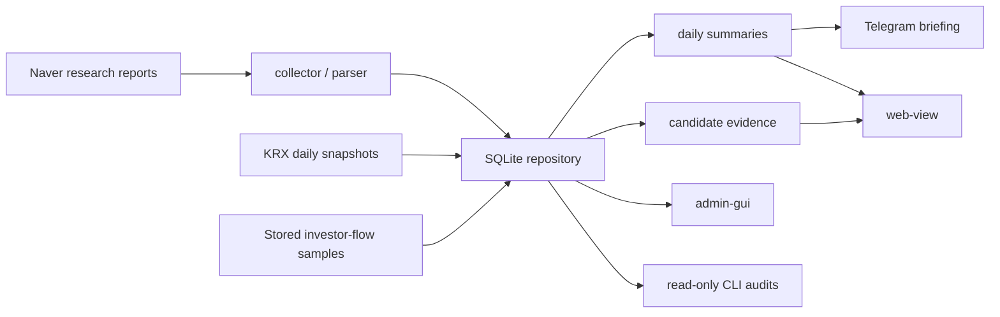

# Stock Monitor

국내 리서치 리포트와 저장된 KRX 기준 데이터를 묶어, 매일 확인할 종목과 시장 흐름을 읽기 쉽게 정리하는 개인용 Python/SQLite MVP입니다.

이 프로젝트는 투자 판단을 대신하는 자동매매 시스템이 아닙니다. 공개 화면과 알림은 리포트, 시장 참고값, 후보 근거를 정리해 보여주는 용도이며 공개 숫자 점수, 투자 등급, 매수/매도 지시, 진입/청산가, 주문 라우팅, 브로커 실행 연동은 제공하지 않습니다.

## Project Overview

Stock Monitor는 네이버 증권 국내종목 리서치 페이지를 장중 수집하고, SQLite에 저장한 뒤 다음 출력면으로 보여줍니다.

- 개인 운영용 Telegram 요약과 명령 처리
- 로컬 운영자 콘솔인 `admin-gui`
- 저장 데이터 기반 읽기 전용 `web-view`
- KRX 일별 주식/ETF/지수 기준값과 제한된 투자자 수급 참고
- 후보 종목을 점수화하지 않고 `오늘의 관찰 후보`, `우선 확인`, `왜 눈에 띄는지` 중심으로 정리하는 관찰 레이어

현재 기준은 로컬 Windows + Python + SQLite + Windows Task Scheduler입니다. 운영 세부 절차는 문서에 두고, README는 공개 저장소에서 전체 구조를 빠르게 파악하는 용도로 유지합니다.

## Feature Highlights

| Area | Main status |
| --- | --- |
| Naver research collection | 국내종목 리포트 수집, 파싱, 중복 방지, 일간 종목 요약 |
| Daily briefing | 전영업일 리포트 흐름과 저장 KRX 참고값을 요약 |
| Telegram | 개인 운영 채널용 요약 발송, 장중 알림, 기본 명령 처리 |
| KRX Open API | 주식, ETF, 지수 일별 snapshot 저장과 누락 보강 |
| KRX Data Marketplace | `[12009]` 종목별 투자자 수급을 리포트 언급 종목 중심으로 제한 활용 |
| Candidate evidence | 저장 리포트, 목표가 흐름, KRX 가격/거래량, 수급 참고를 묶어 관찰 후보 표시 |
| web-view | GET-only/read-only 화면. 일간 요약, 종목 상세, 관찰 후보, 시장/ETF/순환매 참고 |
| admin-gui | 로컬 운영 상태, 스케줄러, 실행 제외일, 설정, audit 확인과 제어 |
| QA/ops checks | DB 검증, web-view 값 QA, 브라우저 smoke, 외부 공유 전 read-only smoke |

## Data Flow / Architecture



Source ownership is kept explicit:

- Naver owns research reports.
- KRX owns stock, ETF, index, turnover, and investor-flow reference data.
- 업종/테마 are a project taxonomy/display layer, not a KRX official taxonomy.
- The user-facing surfaces show stored-data references unless a specific manual reference check is labeled otherwise.

## Surfaces

| Surface | Current role | Boundary |
| --- | --- | --- |
| `web-view` | Public-safe stored-data projection for daily review | GET-only data routes. No scheduler controls, no settings, no operational internals. |
| `admin-gui` | Local operator console | Can show and control operational state. Not a shared information page. |
| Telegram | Personal operator notification channel | Daily/market briefing and commands. New market-briefing automation still requires separate review before scheduling. |
| Future `operator-review` | Planned operator-only review surface for raw evidence and judgment review | Not a current main feature. Keeps raw review work out of `web-view` and avoids bloating `admin-gui`. |

## News Observation, KRX, ETF, And Web-View V2

This README only describes features present in the current `main` working tree.

- **News observation**: the current `main` has report/KRX based observation summaries and candidate evidence. Separate news-intelligence stored observation work is treated as lab/roadmap here unless merged into `main`.
- **KRX reference data**: daily stock, ETF, and index snapshots are stored as reference data. Same-day real-time KRX behavior is not assumed.
- **Investor flow**: automatic collection remains narrow. The approved path is report-mentioned stocks, `[12009]`, recent window, and stored-data display.
- **ETF / rotation view**: stored ETF trend and operator-managed ETF/category mapping can be shown as reference context in `web-view`.
- **web-view v2**: not advertised as a current main route in this README. Treat it as a preview/lab branch unless the route exists in `main`.

## CLI Examples

Install and test locally:

```powershell
python -m pip install -e .[dev]
python -m playwright install chromium
python -m pytest
```

Read-only health and QA checks:

```powershell
python -m stock_monitor db-verify --json
python -m stock_monitor ops-readiness --recent-business-days 4 --stock-limit 20 --json
python -m stock_monitor web-view-value-qa --date latest --stock-limit 20 --json
python -m stock_monitor web-view-browser-smoke --date latest --json
```

Collection and summary commands:

```powershell
python -m stock_monitor inspect-page --limit 5
python -m stock_monitor manual-poll --limit 20
python -m stock_monitor summarize-previous-business-day
python -m stock_monitor send-test-notification --dry-run
```

Local UI commands:

```powershell
python -m stock_monitor web-view --host 127.0.0.1 --port 8780
python -m stock_monitor admin-gui --no-open
```

KRX and evidence review commands:

```powershell
python -m stock_monitor krx-openapi-availability-probe --date latest --endpoint daily --json
python -m stock_monitor krx-backfill-missing daily --lookback-days 90 --max-dates 5 --dry-run
python -m stock_monitor candidate-evidence-readiness --recent-report-dates 5 --stock-limit 20 --json
python -m stock_monitor observation-summary-audit --recent-report-dates 5 --stock-limit 20 --json
python -m stock_monitor rotation-mapping-audit --date latest --json
```

Commands that contact providers, send Telegram messages, or change scheduler/DB state should be reviewed in the project docs first and run with the intended confirmation flags only.

## Development / Testing

The project is intentionally lightweight:

- Python package source lives under `src/stock_monitor`.
- Tests live under `tests`.
- SQLite is the local persistence layer.
- Playwright is used for browser smoke checks.
- Windows Task Scheduler scripts live under `scripts`.

Useful test slices:

```powershell
python -m pytest tests\test_cli_commands.py
python -m pytest tests\test_repository.py
python -m pytest tests\test_web_view.py
python -m pytest tests\test_admin_gui.py
```

Before changing parser, summary, notification, admin, or web-view behavior, check:

- [docs/codex/documentation-index.md](docs/codex/documentation-index.md)
- [docs/codex/data-quality-checklist.md](docs/codex/data-quality-checklist.md)
- [docs/codex/surface-contract.md](docs/codex/surface-contract.md)
- [docs/codex/current-work.md](docs/codex/current-work.md)
- [docs/codex/next-phase.md](docs/codex/next-phase.md)

## Safety Boundaries

Public and shared surfaces must stay descriptive.

Allowed language:

- `오늘의 관찰 후보`
- `우선 확인`
- `관심도 높은 흐름`
- `왜 눈에 띄는지`
- `수급 참고`
- `과열 참고`
- `시장 분위기`

Blocked behavior:

- public numeric scoring or ranking as a decision system
- investment grades or target-action wording
- buy/sell style instructions
- entry/exit/take-profit wording
- automated trading, order placement, or broker integration
- exposing scheduler controls, local DB paths, operational settings, Telegram configuration, or local access details in `web-view`
- wiring lab source probes directly into DB writes, Telegram sends, scheduler jobs, or public surfaces without a fresh review

## Roadmap / Lab Branches

Keep experimental tracks explicit until merged into `main`.

| Track | Status in this README |
| --- | --- |
| Toss OpenAPI | Lab/roadmap. Prepare read-only API mapping and boundaries before using issued keys. |
| Telegram market briefing | Roadmap/lab. Existing Telegram summary exists, but new market-slot briefing automation needs separate review. |
| X/browser recap | Lab only. Treat as research/prototype work, especially where login/session state is involved. |
| News-intelligence stored observations | Lab/roadmap unless merged into `main`. Candidate/news linkage should remain operator-review oriented before public projection. |
| web-view v2 | Preview/lab unless the route and tests are present on `main`. |

## Documentation

The current document map is [docs/codex/documentation-index.md](docs/codex/documentation-index.md).

Key references:

- [stock_research_monitor_mvp.md](stock_research_monitor_mvp.md): product requirements anchor
- [docs/codex/surface-contract.md](docs/codex/surface-contract.md): admin/web-view boundary
- [docs/codex/current-work.md](docs/codex/current-work.md): current state and active blockers
- [docs/codex/next-phase.md](docs/codex/next-phase.md): next-phase direction and closeout criteria
- [docs/codex/krx-market-data-runbook.md](docs/codex/krx-market-data-runbook.md): KRX/ETF/flow operating notes
